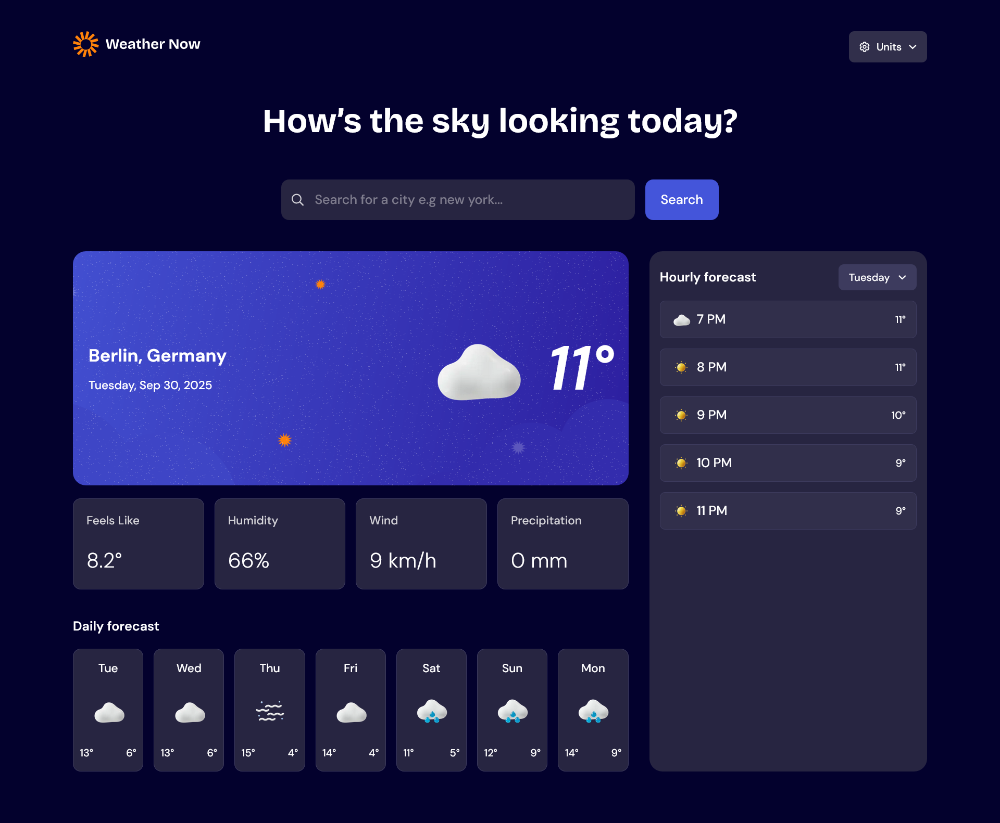

# Frontend Mentor - Weather app solution

This is a solution to the [Weather app challenge on Frontend Mentor](https://www.frontendmentor.io/challenges/weather-app-K1FhddVm49). Weather Now is a responsive weather web app that allows users to check real-time weather conditions, forecasts, and more.

## Table of contents

- [Overview](#overview)
  - [The challenge](#the-challenge)
  - [Screenshot](#screenshot)
  - [Links](#links)
- [My process](#my-process)
  - [Built with](#built-with)
  - [What I learned](#what-i-learned)
  - [Continued development](#continued-development)
  - [Useful resources](#useful-resources)
- [Author](#author)
- [Acknowledgments](#acknowledgments)

## Overview

### The challenge

Users should be able to:

- Search for weather information by entering a location in the search bar
- View current weather conditions including temperature, weather icon, and location details
- See additional weather metrics like "feels like" temperature, humidity percentage, wind speed, and precipitation amounts
- Browse a 7-day weather forecast with daily high/low temperatures and weather icons
- View an hourly forecast showing temperature changes throughout the day
- Switch between different days of the week using the day selector in the hourly forecast section
- Toggle between Imperial and Metric measurement units via the units dropdown
- Switch between specific temperature units (Celsius and Fahrenheit) and measurement units for wind speed (km/h and mph) and precipitation (millimeters) via the units dropdown
- View the optimal layout for the interface depending on their device's screen size
- See hover and focus states for all interactive elements on the page
- Get weather conditions on the users current location
- Install the web app as a PWA

### Screenshot



### Links

- Solution URL: [Solution URL](https://www.frontendmentor.io/solutions/weather-now-pwa-NFE_K2bOGY)
- Live Site URL: [Live site URl](https://weather-now-ose-app.vercel.app/)

## My process

### Built with

- Semantic HTML5 markup
- Flexbox
- CSS Grid
- Mobile-first workflow
- TypeScript
- [React](https://reactjs.org/) - JS library
- [Tailwindcss](https://tailwindcss.com/) - For styles
- [Material ui](https://mui.com/) - for ui animated loaders
- [Tanstack query](https://tanstack.com/) - for fetching data

### What I learned

- fetching data from [Open-meteo](https://open-meteo.com/)
- how to control the number of fetching retries in react query
- how to format isoString date with Intl or date-fns
- minimalistic web scroller
- how to use navigation `navigator.geolocation.getCurrentPosition` to get user current location

> Getting users current location

```ts
useEffect(() => {
  if ("geolocation" in navigator) {
    navigator.geolocation.getCurrentPosition(
      (position) => {
        setUserLocation({
          lat: position.coords.latitude,
          lon: position.coords.longitude,
        });
      },
      () => {
        // If user denies, keep default location
        setUserLocation(defaultLocation);
      }
    );
  }
}, []);
```

> formating isoString date

```ts
new Intl.DateTimeFormat("en-US", {
  weekday: "long", // "Mon", "Tue", etc.
}).format(date);
```

### Continued development

- Implement weather(PWA) notification
- Implement voice search functionality

### Useful resources

- [Open-meteo api docs](https://open-meteo.com/en/docs) - This helped me to know how to use the api and fetch data.
- [MDN docs](https://developer.mozilla.org/) - I learnt how to use Intl date formating from here.

## Author

<!-- - Website - [Add your name here](https://www.your-site.com) -->

- Frontend Mentor - [@Dev-simeon-tech](https://www.frontendmentor.io/profile/Dev-simeon-tech)
- Twitter - [@ose_simeon](https://x.com/ose_simeon)

## Acknowledgments

Thanks to Open-Meteo for providing free APIs, and Frontend Mentor for the challenge idea.
